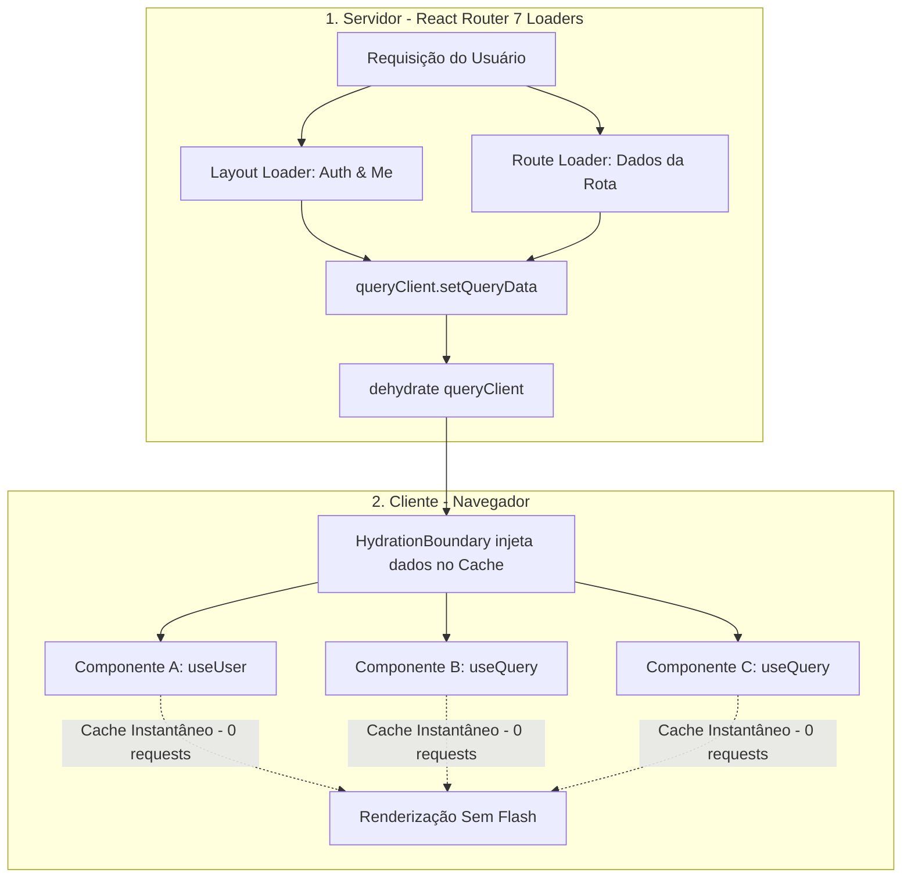

# Frontend Architecture — SSR, Cache e Prevenção de Requisições Duplicadas

Esta skill estabelece a arquitetura obrigatória para o frontend do **iSelfToken** (React 19 + React Router 7 SSR + TanStack Query 5 + Tailwind 4).

O objetivo principal desta arquitetura é **eliminar o desperdício de requisições para o backend**, aproveitando ao máximo a renderização no servidor (SSR) e o cache inteligente do TanStack Query para que o sistema suporte milhares de usuários concorrentes sem gargalos no banco de dados.

---

## 1. Princípios da Arquitetura de Dados



1. **Server-First (Zero Client Waterfall)**: Tudo o que a tela precisa para o primeiro render deve ser carregado no servidor (`loader`). O navegador não deve disparar `GET` logo após montar a página.
2. **Layout como Fonte Única de Sessão**: Dados de autenticação (`user`, `authStatus`, permissões, plano) são buscados **exclusivamente pelo `loader` do Layout**.
3. **Ponte de Hidratação SSR ↔ TanStack Query**: Todo dado carregado no servidor deve ser registrado no `queryClient` via `setQueryData` e repassado com `dehydrate` + `<HydrationBoundary>`.
4. **Deduplicação Automática**: Componentes que precisam da mesma informação compartilham a mesma `queryKey` estruturada. O TanStack Query garante 1 única requisição real.
5. **Invalidação Seletiva**: Mutações (`useMutation`) invalidam apenas as chaves estritamente afetadas, sem recarregar a tela inteira.

---

## 2. Regra 1: Propagação de Dados do Layout (Layout Data Sharing)

O [app/routes/layout/index.tsx](file:///home/kingdev/Documentos/GitHub/Iselftokenv2/frontend/app/routes/layout/index.tsx) é responsável por autenticar e buscar o usuário.

### Como Consumir os Dados do Usuário nas Telas Filhas:
- **Correto**: Usar o hook `useUser()` ou `useQuery(meQueryOptions)`. Como o Layout já populou o cache no SSR, a resposta é **síncrona e instantânea**, sem requisição de rede.
- **Correto**: Usar `useRouteLoaderData("routes/layout/index")` quando precisar de dados crus do loader do layout.
- ❌ **PROIBIDO**: Rota filha ou componente interno disparar `fetch('/api/users/me')`, `fetch('/api/auth/status')` ou chamar `serverFetch` de autenticação no seu próprio loader.

---

## 3. Regra 2: Hidratação SSR Obrigatória em Rotas Privadas e Públicas

Quando uma rota precisa de dados da API para exibir seu conteúdo:

### Padrão Canônico do Loader de Rota (`route.tsx`):
```typescript
import { dehydrate, HydrationBoundary, useQuery } from "@tanstack/react-query";
import { createQueryClient } from "~/lib/query-client";
import { serverFetch } from "~/lib/server-fetch";
import { startupDetailQueryOptions } from "~/lib/queries";
import type { Route } from "./+types/startup-detail";

export async function loader({ request, params }: Route.LoaderArgs) {
  const queryClient = createQueryClient();
  const startupId = params.id;

  // 1. Busca no servidor propagando cookie de sessão
  const res = await serverFetch(request, `/api/startups/${startupId}`);
  if (!res.ok) {
    throw new Response("Startup não encontrada", { status: res.status });
  }
  const startup = await res.json();

  // 2. Popula o cache do TanStack Query no servidor
  queryClient.setQueryData(startupDetailQueryOptions(startupId).queryKey, startup);

  // 3. Retorna o estado desidratado
  return { dehydratedState: dehydrate(queryClient), startupId };
}

export default function StartupDetailPage({ loaderData }: Route.ComponentProps) {
  const { dehydratedState, startupId } = loaderData;

  // 4. Envolve com HydrationBoundary
  return (
    <HydrationBoundary state={dehydratedState}>
      <StartupDetailContent startupId={startupId} />
    </HydrationBoundary>
  );
}

function StartupDetailContent({ startupId }: { startupId: string }) {
  // 5. useQuery lê instantaneamente da memória (isLoading = false, 0 fetches de rede no client)
  const { data: startup } = useQuery(startupDetailQueryOptions(startupId));
  return <div>{startup?.nomeFantasia}</div>;
}
```

---

## 4. Regra 3: Centralização de Query Keys e Query Options

Todas as chaves de query e opções de consulta devem residir em [app/lib/queries.ts](file:///home/kingdev/Documentos/GitHub/Iselftokenv2/frontend/app/lib/queries.ts).

### Estrutura de Chaves:
```typescript
export const queryKeys = {
  auth: {
    status: ['auth-status'] as const,
    me: ['me'] as const,
  },
  startups: {
    all: ['startups'] as const,
    list: (filters: Record<string, unknown>) => ['startups', 'list', filters] as const,
    detail: (id: string | number) => ['startups', 'detail', String(id)] as const,
    dashboardMetrics: ['startups', 'dashboard-metrics'] as const,
  },
  plans: {
    all: ['plans'] as const,
    detail: (id: string | number) => ['plans', String(id)] as const,
  },
  investments: {
    myStartups: ['investments', 'my-startups'] as const,
  },
};
```

---

## 5. Regra 4: Política de `staleTime` e Cache

No arquivo [app/lib/query-client.ts](file:///home/kingdev/Documentos/GitHub/Iselftokenv2/frontend/app/lib/query-client.ts):
- **Padrão Global**: `staleTime: 60_000` (1 minuto).
- **Dados Quase Estáticos** (Planos, Lista de Países, Tipos de Documento): `staleTime: Infinity`.
- **Dados de Sessão (`me`, `auth-status`)**: `staleTime: 60_000` (invalidados apenas por mutações de login/logout/update-profile).
- **Desativar Refetch Agressivo**: `refetchOnWindowFocus: false` (evita que a cada alt-tab o navegador dispare queries para o backend).

---

## 6. Regra 5: Mutações e Invalidação Granular

Ações de escrita (POST, PUT, PATCH, DELETE) utilizam `useMutation`:

```typescript
export function useUpdateStartupMutation(startupId: string) {
  const queryClient = useQueryClient();

  return useMutation({
    mutationFn: async (payload: UpdateStartupDto) => {
      const res = await fetch(`/api/startups/${startupId}`, {
        method: "PATCH",
        headers: { "Content-Type": "application/json" },
        body: JSON.stringify(payload),
      });
      if (!res.ok) throw new Error("Falha ao atualizar dados");
      return res.json();
    },
    onSuccess: () => {
      // Invalida apenas o cache específico
      queryClient.invalidateQueries({ queryKey: queryKeys.startups.detail(startupId) });
      queryClient.invalidateQueries({ queryKey: queryKeys.startups.all });
    },
  });
}
```

---

## 7. Checklist de Anti-Padrões Proibidos (Bloqueantes)

1. ❌ **`fetch` solto dentro de `useEffect`**: Proibido para obter dados de servidor. Usar `useQuery`.
2. ❌ **Refetch de Auth em Páginas Filhas**: Proibido chamar endpoints de autenticação se o layout já os possui.
3. ❌ **Loader SSR sem `setQueryData` / `dehydrate`**: Se o loader busca dados mas não hidrata o TanStack Query, a tela causará waterfall no cliente.
4. ❌ **Strings Mágicas em `queryKey`**: Todas as chaves devem vir do objeto centralizado `queryKeys`.
5. ❌ **Chamada direta ao Backend sem BFF**: Todas as requisições passam por rotas em `app/routes/api/*`.
