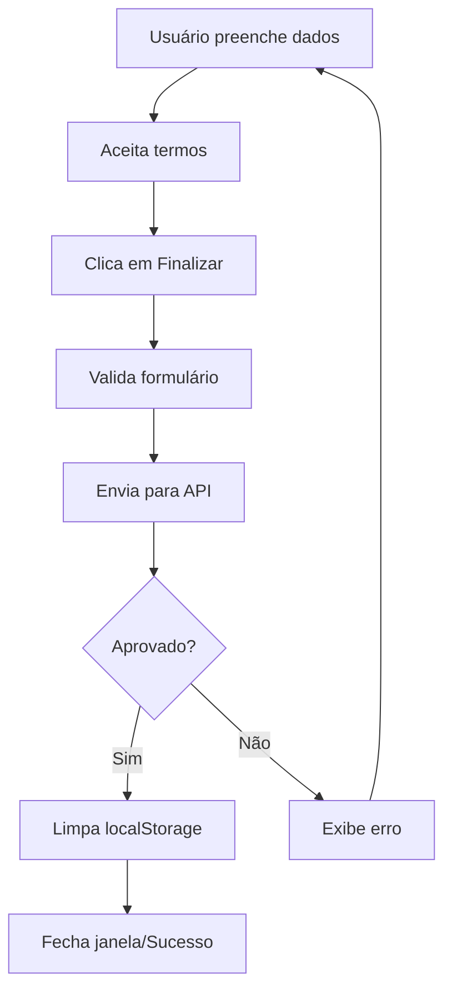
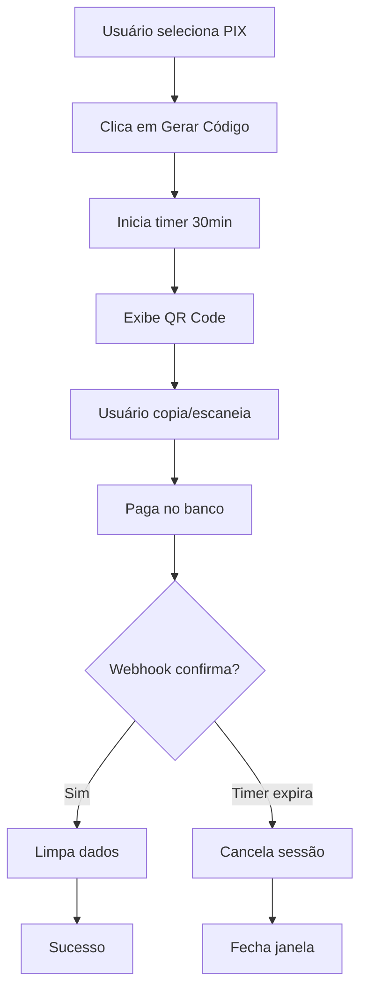

# Documentação - Sistema de Checkout

## 📋 Índice

1. [Visão Geral](#visão-geral)
2. [Arquitetura](#arquitetura)
3. [Estrutura de Dados](#estrutura-de-dados)
4. [Como Usar](#como-usar)
5. [Exemplos Práticos](#exemplos-práticos)
6. [Integração com API de Pagamento](#integração-com-api-de-pagamento)
7. [Fluxo de Pagamento](#fluxo-de-pagamento)
8. [Segurança](#segurança)

---

## 🎯 Visão Geral

A página de checkout é um **componente reutilizável** que processa pagamentos para qualquer tipo de produto da plataforma. Ela foi projetada para ser independente e flexível, permitindo processar desde planos de assinatura até produtos avulsos.

### Características Principais

- ✅ **Reutilizável**: Aceita qualquer tipo de produto via dados parametrizados
- ✅ **Seguro**: Dados transitam via localStorage com validação
- ✅ **Abre em nova janela**: Isolamento da sessão de pagamento
- ✅ **Dois métodos de pagamento**: Cartão de crédito e PIX
- ✅ **Timer automático**: Expira sessão PIX após 30 minutos
- ✅ **Parcelamento inteligente**: Baseado no valor do produto
- ✅ **Layout otimizado**: Interface compacta para janela 1024x768px
- ✅ **Scroll independente**: Painéis com rolagem separada para melhor usabilidade

---

## 🏗️ Arquitetura

### Arquivos do Sistema

```
src/
├── app/(public)/checkout/
│   └── page.tsx                    # Página principal do checkout
├── services/
│   └── CheckoutStorageService.ts   # Gerenciamento do localStorage
└── types/
    └── Checkout.d.ts               # Interfaces TypeScript
```

### Fluxo de Dados

```
[Página de Origem]
    ↓ (cria dados)
[CheckoutStorageService.abrirCheckout(data)]
    ↓ (salva no localStorage)
[Nova Janela: /checkout]
    ↓ (recupera dados)
[CheckoutStorageService.recuperarDadosCheckout()]
    ↓ (processa pagamento)
[API de Pagamento]
    ↓ (sucesso/erro)
[CheckoutStorageService.limparDadosCheckout()]
```

---

## 📦 Estrutura de Dados

### Interface `CheckoutData`

```typescript
interface CheckoutData {
  // Obrigatórios
  userName: string;            // Nome completo do usuário
  userId: string;              // ID único do usuário
  valor: string;               // Valor formatado (ex: "R$ 1.500,00")
  productName: string;         // Nome/título do produto
  productType: string;         // Tipo/categoria do produto
  productDescription: string;  // Descrição detalhada

  // Opcionais
  validity?: number;           // Validade em meses
  obs?: string;                // Observações adicionais
}
```

### Campos Detalhados

| Campo | Tipo | Obrigatório | Descrição | Exemplo |
|-------|------|-------------|-----------|---------|
| `userName` | string | ✅ Sim | Nome completo do cliente | "João Silva" |
| `userId` | string | ✅ Sim | ID único do usuário no sistema | "usr_12345" |
| `valor` | string | ✅ Sim | Valor em formato brasileiro | "R$ 1.500,00" |
| `productName` | string | ✅ Sim | Nome do produto/serviço | "Plano Premium" |
| `productType` | string | ✅ Sim | Categoria do produto | "plano", "consultoria", "token" |
| `productDescription` | string | ✅ Sim | Descrição completa | "Acesso completo por 12 meses" |
| `validity` | number | ❌ Não | Duração em meses | 12 |
| `obs` | string | ❌ Não | Observações extras | "Inclui suporte premium" |

---

## 🚀 Como Usar

### 1. Importar o Serviço

```typescript
import CheckoutStorageService from '@/services/CheckoutStorageService';
import { CheckoutData } from '@/types/Checkout';
```

### 2. Preparar os Dados

```typescript
const dadosCheckout: CheckoutData = {
  userName: 'João Silva',
  userId: 'usr_12345',
  valor: 'R$ 1.500,00',
  productName: 'Plano Premium',
  productType: 'plano',
  productDescription: 'Acesso completo à plataforma por 12 meses',
  validity: 12,
  obs: 'Inclui suporte técnico 24/7',
};
```

### 3. Abrir o Checkout

```typescript
// Método 1: Abrir em nova janela (recomendado)
const handleComprar = () => {
  const janela = CheckoutStorageService.abrirCheckout(dadosCheckout);

  if (!janela) {
    alert('Não foi possível abrir a janela de checkout');
  }
};

// Método 2: Salvar e redirecionar na mesma aba
const handleComprarMesmaAba = () => {
  const salvou = CheckoutStorageService.salvarDadosCheckout(dadosCheckout);

  if (salvou) {
    router.push('/checkout');
  } else {
    alert('Erro ao preparar checkout');
  }
};
```

### 4. Customizar a Janela (Opcional)

```typescript
// Tamanho padrão: 1024x768px (otimizado)
CheckoutStorageService.abrirCheckout(dadosCheckout);

// Customizar tamanho e comportamento da janela
CheckoutStorageService.abrirCheckout(
  dadosCheckout,
  'width=1400,height=900,scrollbars=yes,resizable=yes,menubar=no,toolbar=no'
);
```

---

## 💡 Exemplos Práticos

### Exemplo 1: Checkout de Plano de Assinatura

```typescript
'use client';

import { useRouter } from 'next/navigation';
import CheckoutStorageService from '@/services/CheckoutStorageService';
import { CheckoutData } from '@/types/Checkout';

export default function PlansPage() {
  const router = useRouter();

  const handleSelectPlan = (planData: any) => {
    const checkoutData: CheckoutData = {
      userName: 'Maria Santos',
      userId: 'usr_98765',
      valor: 'R$ 997,00',
      productName: `Plano ${planData.nome}`,
      productType: 'assinatura',
      productDescription: `Acesso completo por ${planData.validade} meses`,
      validity: planData.validade,
      obs: planData.beneficios.join(', '),
    };

    // Abre checkout em nova janela
    const checkoutWindow = CheckoutStorageService.abrirCheckout(checkoutData);

    if (checkoutWindow) {
      console.log('Checkout aberto com sucesso');
    }
  };

  return (
    <div>
      <button onClick={() => handleSelectPlan({
        nome: 'Premium',
        validade: 12,
        beneficios: ['Suporte 24/7', 'API ilimitada']
      })}>
        Comprar Plano Premium
      </button>
    </div>
  );
}
```

### Exemplo 2: Checkout de Produto Único

```typescript
const handleComprarToken = () => {
  const checkoutData: CheckoutData = {
    userName: user.name,
    userId: user.id,
    valor: 'R$ 150,00',
    productName: 'Pacote 1000 Tokens',
    productType: 'token',
    productDescription: '1000 tokens para uso na plataforma',
  };

  CheckoutStorageService.abrirCheckout(checkoutData);
};
```

### Exemplo 3: Checkout de Consultoria

```typescript
const handleAgendarConsultoria = (consultorId: string) => {
  const checkoutData: CheckoutData = {
    userName: session?.user?.name || '',
    userId: session?.user?.id || '',
    valor: 'R$ 500,00',
    productName: 'Consultoria Individual',
    productType: 'consultoria',
    productDescription: 'Sessão de 2 horas com especialista',
    obs: `Consultor ID: ${consultorId}`,
  };

  CheckoutStorageService.abrirCheckout(checkoutData);
};
```

### Exemplo 4: Verificar Dados Antes de Processar

```typescript
// Em qualquer lugar do código
const temDados = CheckoutStorageService.temDadosCheckout();

if (temDados) {
  const dados = CheckoutStorageService.recuperarDadosCheckout();
  console.log('Dados de checkout pendentes:', dados);
}

// Limpar dados manualmente se necessário
CheckoutStorageService.limparDadosCheckout();
```

---

## 🔌 Integração com API de Pagamento

### Localização do Código

O processamento do pagamento está na função `handleSubmit` em [src/app/(public)/checkout/page.tsx:183-215](src/app/(public)/checkout/page.tsx#L183-L215).

### Implementação Atual (Simulada)

```typescript
const handleSubmit = async (e: React.FormEvent) => {
  e.preventDefault();

  if (!formData.termsAccepted) {
    alert('Você precisa aceitar os termos e condições');
    return;
  }

  setIsProcessing(true);

  try {
    // TODO: Substituir por chamada real à API de pagamento
    await new Promise((resolve) => setTimeout(resolve, 3000));

    // Limpar dados após sucesso
    CheckoutStorageService.limparDadosCheckout();

    alert('Pagamento processado com sucesso!');
    window.close();
  } catch (error) {
    console.error('Erro ao processar pagamento:', error);
    alert('Erro ao processar pagamento. Tente novamente.');
  } finally {
    setIsProcessing(false);
  }
};
```

### Como Integrar com API Real

```typescript
const handleSubmit = async (e: React.FormEvent) => {
  e.preventDefault();

  if (!formData.termsAccepted) {
    alert('Você precisa aceitar os termos e condições');
    return;
  }

  if (!checkoutData) {
    alert('Dados do checkout não encontrados');
    return;
  }

  setIsProcessing(true);

  try {
    // Preparar dados para API
    const paymentData = {
      userId: checkoutData.userId,
      productName: checkoutData.productName,
      productType: checkoutData.productType,
      amount: parseCurrency(checkoutData.valor),
      paymentMethod: paymentMethod,

      // Dados do cartão (se cartão)
      ...(paymentMethod === 'credit' && {
        cardNumber: formData.cardNumber.replace(/\s/g, ''),
        cardName: formData.cardName,
        expiryDate: formData.expiryDate,
        cvv: formData.cvv,
        installments: parseInt(formData.installments),
      }),

      // Dados do PIX (se PIX)
      ...(paymentMethod === 'pix' && {
        pixCode: '1234-5678-9012-3456-7890-1234-5678-9012',
      }),
    };

    // Chamar API de pagamento
    const response = await fetch('/api/pagamento/processar', {
      method: 'POST',
      headers: {
        'Content-Type': 'application/json',
      },
      body: JSON.stringify(paymentData),
    });

    const result = await response.json();

    if (result.success) {
      // Limpar dados após sucesso
      CheckoutStorageService.limparDadosCheckout();

      // Redirecionar para página de sucesso
      window.location.href = `/pagamento/sucesso?transactionId=${result.transactionId}`;
    } else {
      throw new Error(result.message || 'Erro ao processar pagamento');
    }
  } catch (error) {
    console.error('Erro ao processar pagamento:', error);
    alert(`Erro: ${error.message}`);
  } finally {
    setIsProcessing(false);
  }
};
```

### Integração com Gateway de Pagamento (Exemplo: Stripe)

```typescript
import { loadStripe } from '@stripe/stripe-js';

const stripePromise = loadStripe(process.env.NEXT_PUBLIC_STRIPE_PUBLIC_KEY!);

const handleSubmit = async (e: React.FormEvent) => {
  e.preventDefault();

  setIsProcessing(true);

  try {
    // 1. Criar payment intent no backend
    const response = await fetch('/api/pagamento/create-payment-intent', {
      method: 'POST',
      headers: { 'Content-Type': 'application/json' },
      body: JSON.stringify({
        amount: parseCurrency(checkoutData.valor) * 100, // centavos
        userId: checkoutData.userId,
        productName: checkoutData.productName,
      }),
    });

    const { clientSecret } = await response.json();

    // 2. Confirmar pagamento com Stripe
    const stripe = await stripePromise;
    const { error, paymentIntent } = await stripe!.confirmCardPayment(
      clientSecret,
      {
        payment_method: {
          card: elements.getElement(CardElement)!,
          billing_details: {
            name: formData.cardName,
          },
        },
      }
    );

    if (error) {
      throw new Error(error.message);
    }

    if (paymentIntent.status === 'succeeded') {
      CheckoutStorageService.limparDadosCheckout();
      alert('Pagamento aprovado!');
      window.close();
    }
  } catch (error) {
    alert(`Erro: ${error.message}`);
  } finally {
    setIsProcessing(false);
  }
};
```

---

## 🔄 Fluxo de Pagamento

### 1. Cartão de Crédito



### 2. PIX



---

## 🔒 Segurança

### Boas Práticas Implementadas

1. **Validação de Dados**: Todos os campos obrigatórios são validados antes de salvar
2. **Timeout Automático**: Sessão PIX expira após 30 minutos
3. **Limpeza de Dados**: localStorage é limpo após sucesso ou cancelamento
4. **Confirmação de Saída**: Usuário confirma antes de cancelar
5. **Isolamento de Sessão**: Checkout abre em janela separada

### O que Você Deve Implementar

1. **Criptografia**: Nunca enviar dados sensíveis do cartão sem criptografia
2. **HTTPS**: Sempre usar conexão segura
3. **PCI Compliance**: Seguir normas de segurança para dados de cartão
4. **Rate Limiting**: Limitar tentativas de pagamento
5. **Logs**: Registrar todas as transações (sem dados sensíveis)
6. **Tokenização**: Usar tokens em vez de dados reais do cartão

### Exemplo de Segurança Adicional

```typescript
// Antes de salvar no localStorage, você pode criptografar
import CryptoJS from 'crypto-js';

const SECRET_KEY = process.env.NEXT_PUBLIC_CHECKOUT_KEY!;

static salvarDadosCheckout(data: CheckoutData): boolean {
  try {
    // Criptografar dados antes de salvar
    const encrypted = CryptoJS.AES.encrypt(
      JSON.stringify(data),
      SECRET_KEY
    ).toString();

    localStorage.setItem(this.CHECKOUT_KEY, encrypted);
    return true;
  } catch (error) {
    console.error('Erro ao salvar dados:', error);
    return false;
  }
}

static recuperarDadosCheckout(): CheckoutData | null {
  try {
    const encrypted = localStorage.getItem(this.CHECKOUT_KEY);
    if (!encrypted) return null;

    // Descriptografar dados
    const decrypted = CryptoJS.AES.decrypt(encrypted, SECRET_KEY);
    const data = JSON.parse(decrypted.toString(CryptoJS.enc.Utf8));

    return data as CheckoutData;
  } catch (error) {
    console.error('Erro ao recuperar dados:', error);
    return null;
  }
}
```

---

## 📝 Métodos Disponíveis

### `CheckoutStorageService`

| Método | Parâmetros | Retorno | Descrição |
|--------|-----------|---------|-----------|
| `salvarDadosCheckout(data)` | `CheckoutData` | `boolean` | Salva dados no localStorage |
| `recuperarDadosCheckout()` | - | `CheckoutData \| null` | Recupera dados do localStorage |
| `limparDadosCheckout()` | - | `void` | Remove dados do localStorage |
| `temDadosCheckout()` | - | `boolean` | Verifica se há dados salvos |
| `abrirCheckout(data, features?)` | `CheckoutData, string?` | `Window \| null` | Abre checkout em nova janela |

---

## 🎨 Regras de Parcelamento

| Valor | Parcelas Disponíveis | Juros |
|-------|---------------------|-------|
| < R$ 100 | 1x | Sem juros |
| R$ 100 - R$ 499,99 | 1x a 3x | Sem juros |
| R$ 500 - R$ 2.999,99 | 1x a 10x | Sem juros |
| ≥ R$ 3.000 | 1x a 15x | Sem juros |

Essas regras são configuradas na função `getOpcoesParcelamento()` em [src/app/(public)/checkout/page.tsx:106-144](src/app/(public)/checkout/page.tsx#L106-L144).

---

## ⚙️ Configurações Avançadas

### Layout e Dimensões

A página de checkout foi otimizada para **1024x768px** com as seguintes características:

**Estrutura do Layout:**
- **Header**: 57px de altura (compacto)
- **Painel Esquerdo (Formulário)**: 58% da largura, scroll vertical independente
- **Painel Direito (Resumo)**: 42% da largura, scroll vertical independente
- **Espaçamentos**: Reduzidos para melhor aproveitamento do espaço
- **Fontes**: Otimizadas (xs, sm) para legibilidade em tela menor

**Componentes Compactos:**
- Botões: `py-3` (12px verticalmente)
- Inputs: `py-2.5` (10px verticalmente)
- Labels: `text-xs` (12px)
- Cards: `p-4` (16px padding)
- Ícones: `h-4 w-4` (16x16px) ou `h-5 w-5` (20x20px)

### Customizar Timer do PIX

```typescript
// Alterar tempo padrão (atualmente 30 minutos)
const [timeRemaining, setTimeRemaining] = useState(45 * 60); // 45 minutos
```

### Customizar Janela de Checkout

```typescript
// Padrão otimizado (1024x768)
CheckoutStorageService.abrirCheckout(data);

// Fullscreen
CheckoutStorageService.abrirCheckout(data, 'fullscreen=yes');

// Tamanho específico
CheckoutStorageService.abrirCheckout(
  data,
  'width=1600,height=1000,left=100,top=50'
);

// Sem barra de ferramentas
CheckoutStorageService.abrirCheckout(
  data,
  'toolbar=no,menubar=no,location=no'
);

// Centralizar na tela
const left = (screen.width - 1024) / 2;
const top = (screen.height - 768) / 2;
CheckoutStorageService.abrirCheckout(
  data,
  `width=1024,height=768,left=${left},top=${top}`
);
```

---

## 🐛 Troubleshooting

### Problema: Janela não abre

**Causa**: Popup bloqueado pelo navegador

**Solução**:
```typescript
const janela = CheckoutStorageService.abrirCheckout(data);

if (!janela || janela.closed) {
  alert('Por favor, permita popups para este site');
}
```

### Problema: Dados não são recuperados

**Causa**: localStorage desabilitado ou SSR

**Solução**: Verificar se está no cliente
```typescript
useEffect(() => {
  if (typeof window === 'undefined') {
    console.warn('Executando no servidor');
    return;
  }

  const dados = CheckoutStorageService.recuperarDadosCheckout();
  // ...
}, []);
```

### Problema: Timer não funciona corretamente

**Causa**: useEffect não está limpando o interval

**Solução**: Já implementado em [src/app/(public)/checkout/page.tsx:55-77](src/app/(public)/checkout/page.tsx#L55-L77)

---

## 📞 Suporte

Para dúvidas ou problemas:

1. Verifique esta documentação
2. Consulte os tipos em [src/types/Checkout.d.ts](src/types/Checkout.d.ts)
3. Revise o código em [src/app/(public)/checkout/page.tsx](src/app/(public)/checkout/page.tsx)
4. Teste o serviço em [src/services/CheckoutStorageService.ts](src/services/CheckoutStorageService.ts)

---

**Última atualização**: 2025-11-21
**Versão**: 1.1.0 - Layout otimizado para 1024x768px
