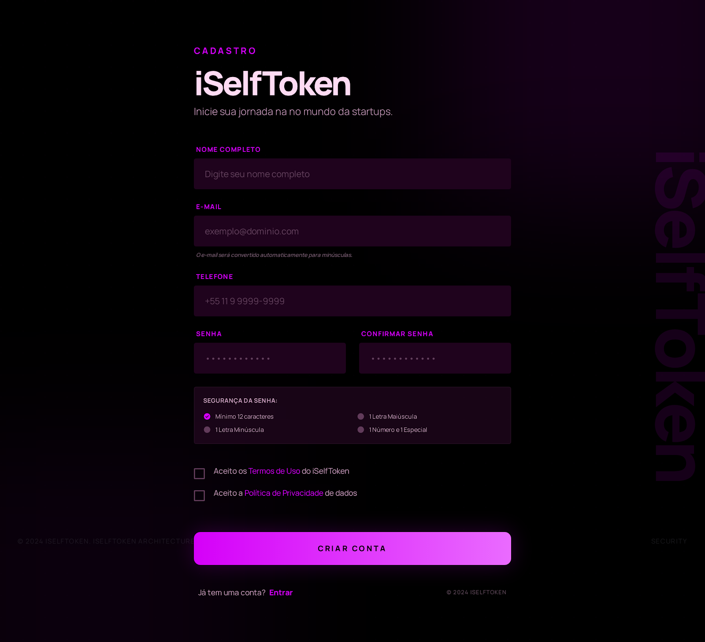
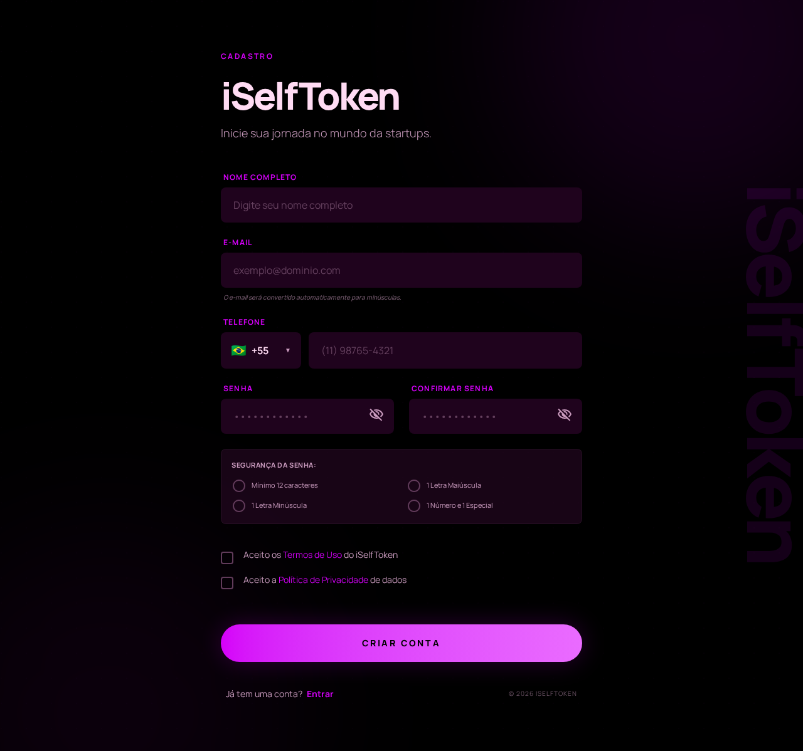

# Comparação de Layout - Tela de Registro

Este documento serve para documentar visualmente e comparar a tela de cadastro implementada com o design aprovado pelo cliente.

## 🎨 Comparação Lado a Lado

| Design Aprovado (Cliente) | Implementação Real (Navegador) |
|:---:|:---:|
|  |  |

---

## 🛠️ Informações Técnicas da Tela

* **Caminho da Rota**: `app/routes/public/register.tsx`
* **Caminho do Componente**: `app/components/auth/register-form.tsx`
* **Caminho do Container**: `app/components/auth/register-container.tsx`
* **Role Padrão**: Todos os usuários cadastrados recebem `"role": "INVESTOR"` por padrão.
* **Validação de Senha**: Mínimo de 12 caracteres contendo 1 Letra Maiúscula, 1 Letra Minúscula, 1 Número e 1 Caractere Especial.
* **Integração com API**: Chamada POST proxied via BFF para `/auth/register/user`.
